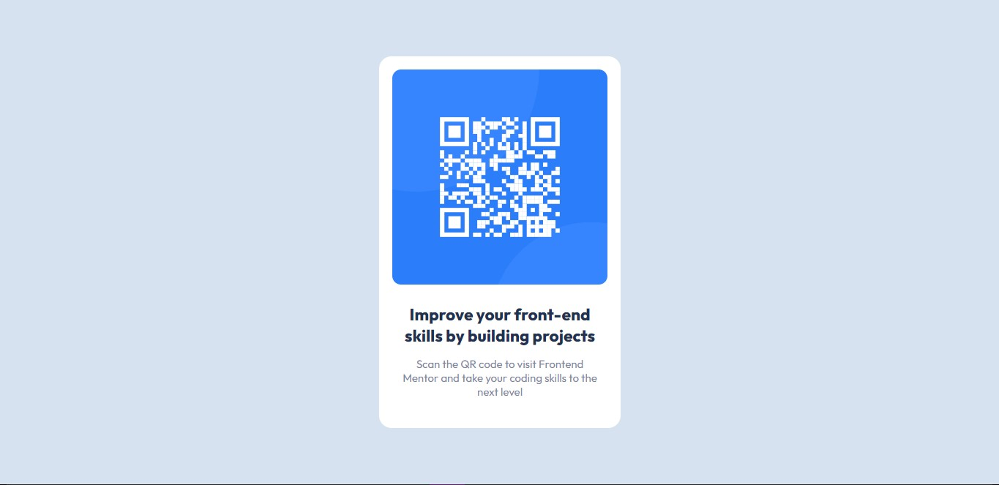

# Frontend Mentor - QR code component solution

This is a solution to the [QR code component challenge on Frontend Mentor](https://www.frontendmentor.io/challenges/qr-code-component-iux_sIO_H). Frontend Mentor challenges help you improve your coding skills by building realistic projects. 

## Table of contents

- [Overview](#overview)
  - [Screenshot](#screenshot)
  - [Links](#links)
- [My process](#my-process)
  - [Built with](#built-with)
  - [What I learned](#what-i-learned)
  - [Continued development](#continued-development)
  - [Useful resources](#useful-resources)
- [Author](#author)
- [Acknowledgments](#acknowledgments)


## Overview

### Screenshot




### Links

- Solution URL: (https://github.com/Radiostranger/qr-code-component-main)
- Live Site URL: [qr-component-new.netlify.app](https://qr-component-new.netlify.app)

## My process

### Built with

- Semantic HTML5 markup
- CSS custom properties
- Flexbox
- CSS Grid
- Mobile-first workflow

### What I learned

I realised that the solutions to some problems are not far fetched, and sometimes you just need  to take a break.

To see how you can add code snippets, see below:

<!-- ```html
<h1>Some HTML code I'm proud of</h1>
```
```css
.proud-of-this-css {
  color: papayawhip;
}
```
```js
const proudOfThisFunc = () => {
  console.log('🎉')
}
``` -->

### Continued development


### Useful resources

- [Mr Coder(YouTube)](https://www.youtube.com/watch?v=5BBYPntB-GY) - This helped me figure out exactly the CSS properties needed . I really liked this pattern and will use it going forward.

## Author

- Website - [Albert Ikechukwu Chukwudozie](https://www.ikechukwuchukwudozie.netlify.app)
- Frontend Mentor - [@Radiostranger](https://www.frontendmentor.io/profile/Radiostranger)
- Twitter - [@Radiostranger9](https://www.twitter.com/Radiostranger9)


## Acknowledgments

I want to thank "Mr Coder" on youtube for posting content that made it easier to complete this task 

